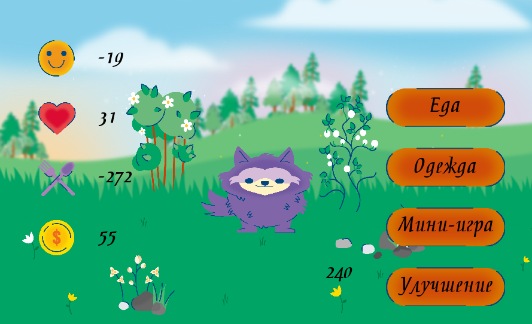
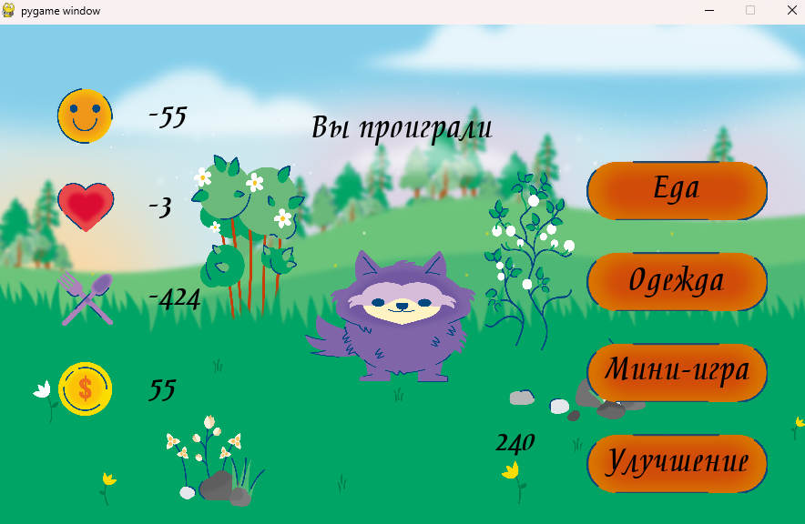

# Игра "Виртуальный питомец"
## Описание
Игра позволяет ухаживать, играть, кормить и одевать виртуального питомца.
## Возможности игры
- Выбор одежды для питомца.
- Возможность накормить питомца.
- Чтобы процент счастья рос,с питомцем можно поиграть в мини-игру.
- Возможность улучшения кликера.
- На главной странице игры можно увидеть процент здоровья, счастья, сытости и число денег питомца.
## Чему научилась
- Универсальные формулы для подсчёта координат объектов с учётом изменения размеров окна.
-  Универсальный класс для кнопок, которые можно использовать
в любой части текущего проекта и в других проектах тоже.
-  Меню для выбора еды и одежды с возможностью переключения и покупки
еды и одежды.
- Меню мини-игры с полноценной небольшой игрой внутри основного проекта.
- Загрузка и сохранение сессий в json-файлы.
- Возможность покупки улучшений для кликера.
## Работа игры
### Главная страница игры

### Выбор одежды

### Выбор еды

### Мини-игра

### Улучшение

### Проигрыш

